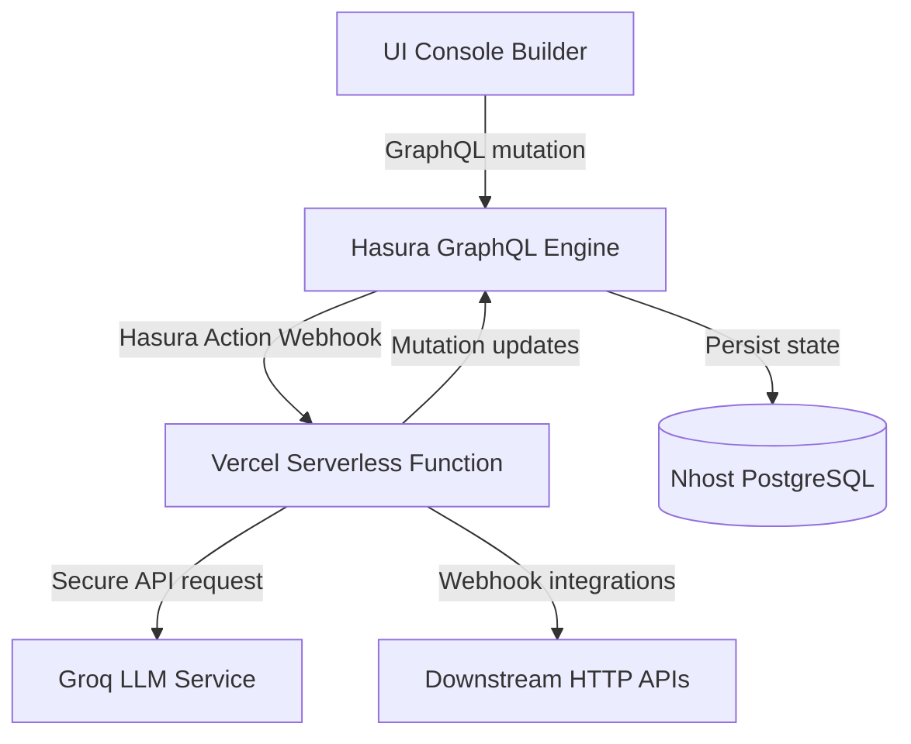

# AI Agent Workflow Builder

A serverless B2B AI workflow automation platform built on Nhost, Hasura GraphQL, and Next.js.

The platform provides a secure environment for authenticated users to model, sequence, and execute complex AI-driven data pipelines. Workflows are composed of modular steps (such as LLM classifications and HTTP integrations) that run within a server-side execution engine capable of dynamically altering the control flow based on AI decisions.

All organization memberships, permission boundaries, and usage quotas are strictly enforced at the API route layer rather than trusted from browser inputs.

---

## 1. System Architecture

The platform separates client-side visual builders from server-side execution boundaries, utilizing Hasura Actions as the secure API bridge:



* **Client Layer**: A React SPA built with Next.js and Tailwind CSS. The interface interacts with Nhost using GraphQL subscriptions and queries for instantaneous updates.
* **Hasura GraphQL Layer**: Manages the API gateway. When a workflow is run, the client fires a `triggerWorkflowRun` mutation, which Hasura executes via a serverless Action webhook.
* **Vercel Execution Layer**: A serverless route handler that securely executes steps. By receiving authenticated user ID and role directly from Hasura session header context, it prevents browser-spoofing.

---

## 2. Key Features

* **Role-Aware Workspaces**: Isolates workflows within organization boundaries and determines capabilities using organization role claims (`owner`, `editor`, `viewer`).
* **Server-Side Execution Engine**: Evaluates workflows securely at the server layer. Organization identity is derived from authenticated session headers.
* **LLM-Driven Conditional Execution**: Alters execution flow dynamically at runtime based on structured JSON responses returned by LLM classification nodes.
* **HTTP Webhook Integration**: Executes fetch requests to external HTTP services, supporting custom methods, body configurations, and dynamic header mappings.
* **Observability History**: Displays real-time and historical execution logs, complete with individual step statuses (`completed`, `failed`, `skipped`), attempt counts, inputs, and outputs.
* **Quota Enforcement**: Blocks workflow execution for organizations exceeding their monthly run limits.
* **Fault Tolerance & Retries**: Employs transient fault handlers to retry failed network integrations (HTTP or LLM) before failing the workflow run.

---

## 3. Standout Feature — LLM-Driven Branching

Rather than using LLMs merely for text generation, the platform supports **LLM-driven conditional execution** where structured output from an LLM step directly governs the execution path of the workflow.

```
                  [ Support Message Input ]
                              │
                              ▼
                     [ LLM Classifier Node ]
                              │
                    (Classifies message)
                              │
                              ▼
                 [ Conditional Branch Node ]
            (Condition: classification == "urgent")
                              │
                     ┌────────┴────────┐
             [ TRUE ]                  [ FALSE ]
                 │                         │
                 ▼                         ▼
         [ HTTP Webhook ]          [ Skipped Webhook ]
        (Notifies support)        (Logs normal ticket)
```

### Execution Lifecycle:
1. **Input Payload**: A customer message is supplied (e.g. `"URGENT: My payment was deducted twice."`).
2. **LLM Classification**: The LLM step processes the message using a structured prompt:
   ```
   Classify the customer message as exactly one of: urgent, normal.
   Return ONLY valid JSON: { "classification": "urgent" }
   ```
3. **Conditional Evaluation**: The conditional node parses the LLM's JSON output and executes a case-insensitive evaluation (`previous.output.classification == urgent`).
4. **Control Flow Branching**:
   * If `true`, the downstream HTTP step is executed.
   * If `false`, the execution engine skips the HTTP step and logs a `skipped` state to the database, preventing unnecessary API calls.

---

## 4. Execution Model

When a workflow run is triggered:
1. **Session Authentication**: The Vercel API endpoint `/api/trigger-workflow-run` validates the presence of the `x-hasura-user-id` session variable.
2. **Permission Resolution**: The handler queries the workflow and ensures the caller is an active member of the organization with `owner` or `editor` rights.
3. **Quota Checks**: Inspects the organization's current run quota usage; triggers a `429 Quota Exceeded` response if the limit is breached.
4. **Run Registration**: Creates a new database log in `workflow_runs` with status `running` and `trigger_type` set to `"manual"`.
5. **Sequential Evaluation Loop**: Reads all step configurations sorted by `position`.
   * Substitutes dynamic placeholders (`{{previous_output}}`) with the output of the preceding step.
   * Runs LLM models or HTTP requests.
   * If a conditional step evaluates to `false`, the engine sets a skip flag to bypass the subsequent node, logging its status as `skipped`.
6. **Persistence**: Every step execution status is stored in `step_runs` with raw inputs, outputs, error details, and attempt counts.
7. **Increment Quota**: Upon successful completion, the organization's `quota_used` is incremented.

---

## 5. Supported Step Types

| Step Type | Purpose | Status | Configuration Fields |
|:---|:---|:---|:---|
| **🤖 LLM Call** | Executes LLM prompts via Groq API. | **Fully Implemented** | `model` (String), `prompt` (String) |
| **🌐 HTTP Request** | Makes external REST/Webhook calls. | **Fully Implemented** | `method` (GET/POST/etc.), `url` (String), `headers` (JSON), `body` (String) |
| **🌿 Conditional Branch**| Routes control flow based on conditions. | **Fully Implemented** | `condition` (String/JSON), `skipOnTrue` (Bool), `skipOnFalse` (Bool) |
| **💾 DB Write** | Mock node for database writes. | *Stub (Config Saved)* | `target` (String), `data` (JSON) |
| **🔔 Notification** | Mock node for notification channels. | *Stub (Config Saved)* | `channel` (String), `message` (String) |
| **⏸ Approval Gate** | Mock node for manual approval states. | *Stub (Config Saved)* | `approvers` (Array) |

---

## 6. Data Model

The PostgreSQL schema structure:

```
[ organizations ] ──► [ org_members ] (joins users with role attributes)
       │
       └─► [ workflows ] ──► [ workflow_steps ] (node positions & configs)
                 │
                 └─► [ workflow_runs ] ──► [ step_runs ] (execution step logs)
```

* **`organizations`**: Master tenant records tracking resource limits (`quota_limit`, `quota_used`).
* **`org_members`**: Link table mapping users to tenant organizations with access roles (`owner`, `editor`, `viewer`).
* **`workflows`**: Holds metadata for automation pipelines, including names and descriptions.
* **`workflow_steps`**: Config definitions mapping to individual step parameters. Uses a floating `position` integer for execution sorting.
* **`workflow_runs`**: Execution log capturing start times, end times, overall status (`running`, `completed`, `failed`), and the `trigger_type` (`"manual"`).
* **`step_runs`**: Individual step logs mapping inputs, outputs, statuses (`completed`, `failed`, `skipped`), and retry attempts back to a parent `workflow_run`.

---

## 7. Security Design & Authorization Boundaries

* **No Front-End Spoofing**: All GraphQL mutations verifying organization permission boundaries run on the server using session values derived from verified browser JWT tokens.
* **Secret Protection**: AI API tokens (`GROQ_API_KEY`) and database administrative keys (`NHOST_ADMIN_SECRET`) reside strictly in the server environment, never exposing them to the client browser.
* **Hasura Action Barrier**: The trigger endpoint `/api/trigger-workflow-run` validates requests by checking the custom headers sent by the Hasura Engine, preventing unauthorized calls.

---

## 8. Tech Stack & Project Structure

* **Frontend**: React, Next.js (App Router, Turbopack), Tailwind CSS, urql GraphQL client
* **Backend**: Next.js API Routes, Hasura Actions, Groq SDK (Llama 3 models)
* **Database & Auth**: PostgreSQL and Nhost Auth (hosted on Nhost)

```
├── app/
│   ├── (auth)/             # Guest routes and login screen
│   ├── (dashboard)/        # Main dashboard console and workflow workspace
│   └── api/                # Execution engine endpoint (/api/trigger-workflow-run)
├── components/             # Reusable UI component workspace (AuthGuard, StepConfigUIs)
├── graphql/                # Static GraphQL query and mutation documents
├── hasura/                 # Hasura configuration schema and Action metadata
└── lib/                    # Shared client initialization scripts (Nhost/urql)
```

---

## 9. Getting Started

### Prerequisites
* **Node.js**: Version 18.x or later installed locally.
* **npm**: Version 9.x or later.
* **Accounts**: Nhost console access (PostgreSQL/GraphQL backend) and a Groq developer API key.

### Local Configuration
1. **Clone & Install**:
   ```bash
   git clone <repository-url> && cd project-assign && npm install
   ```

2. **Set Up Local Environment Variables**:
   Create a `.env.local` file at the root of the project:
   ```env
   NHOST_BACKEND_URL=https://your-subdomain.nhost.run
   NEXT_PUBLIC_NHOST_BACKEND_URL=https://your-subdomain.nhost.run
   NEXT_PUBLIC_NHOST_REGION=ap-south-1
   NHOST_ADMIN_SECRET=your_admin_secret_here
   GROQ_API_KEY=your_groq_api_key_here
   NEXT_PUBLIC_SITE_URL=http://localhost:3000
   ```

3. **Run Dev Server**:
   ```bash
   npm run dev
   ```

4. **Verify Build**:
   ```bash
   npx tsc --noEmit && npm run build
   ```

---

## 10. Known Limitations & Engineering Decisions

* **Stubbed Integrations**: DB Write, Notify, and Approval Gate node types are currently stubs. While their configurations are fully saved, reordered, and validated in the database, they do not execute live operations during a run.
* **Single Branch Skipping**: The conditional node implements a skip-next-step approach rather than parallel execution path routing.
* **Server-Side Execution**: Running workflow code inside a server-side webhook rather than in the browser prevents security token leaks (such as the Groq API key) and keeps executions stable.
* **Floating Sequence Position**: Persisting positions as floating/sequential integers in a `position` column permits instant step reordering queries using `order_by: { position: asc }` without requiring complex linked-list graph models.
* **Database as Truth**: Initial parameters are fetched directly from the database rather than trusting values sent by the client, preventing parameter-spoofing.

---

## 11. Project Licensing
This project is provided as reference material for technical evaluation. All rights reserved.
